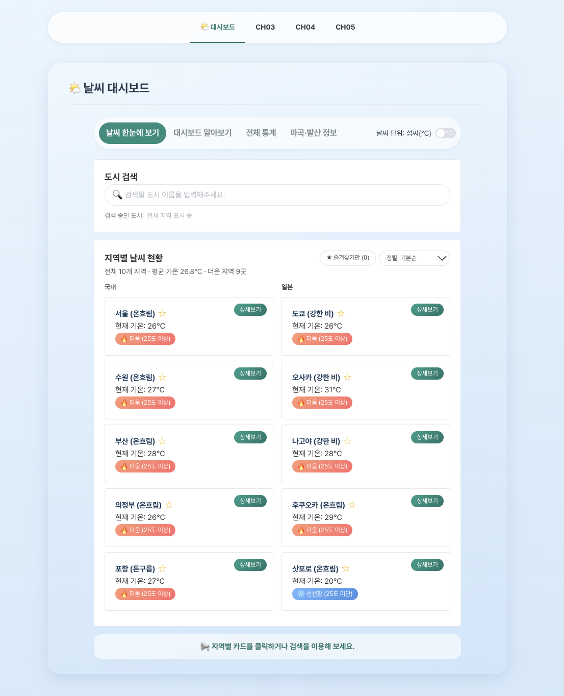
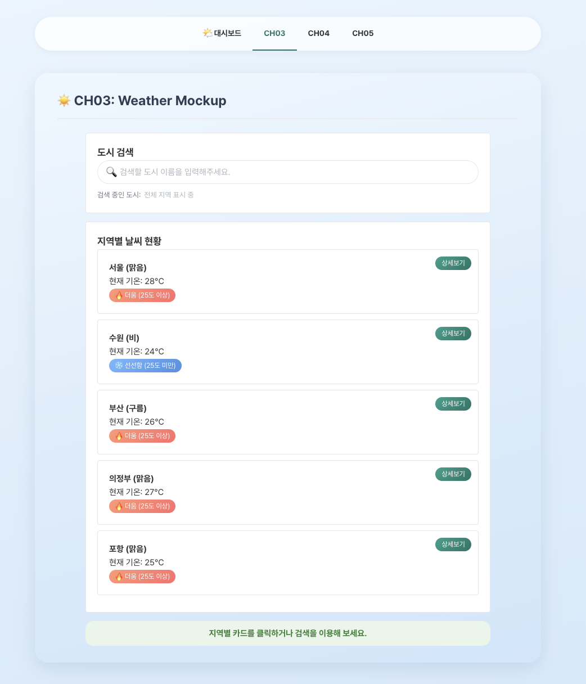
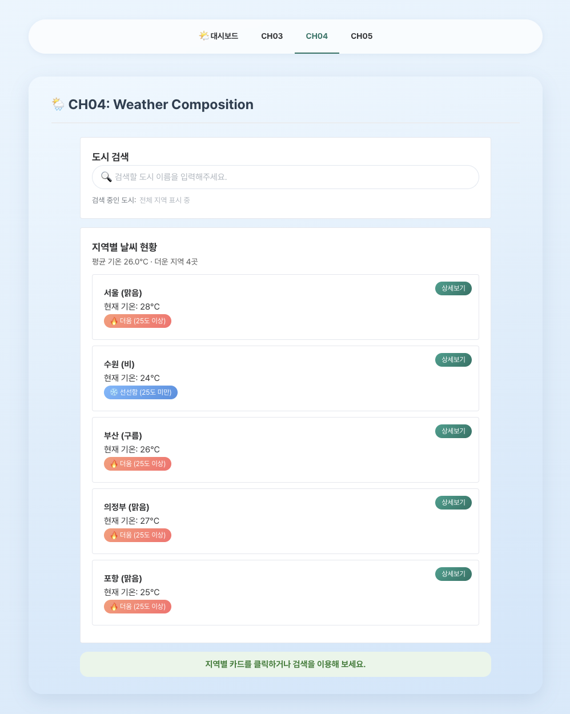
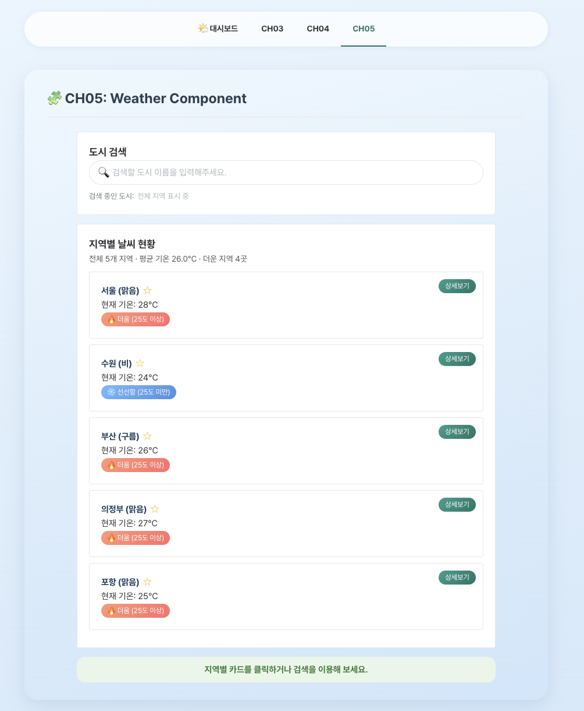
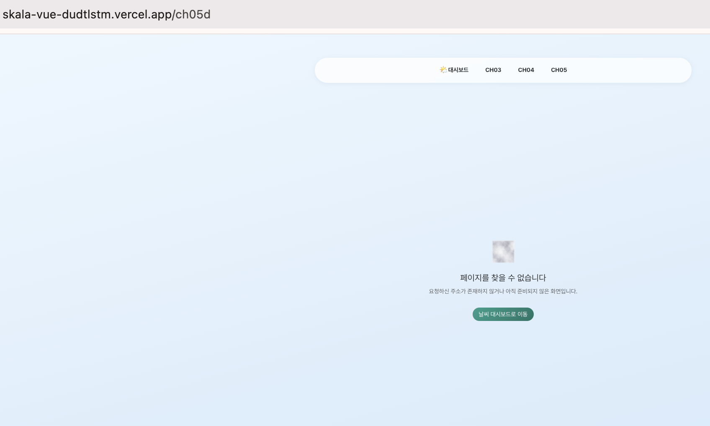
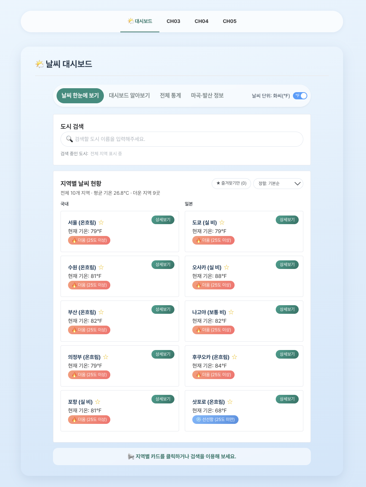
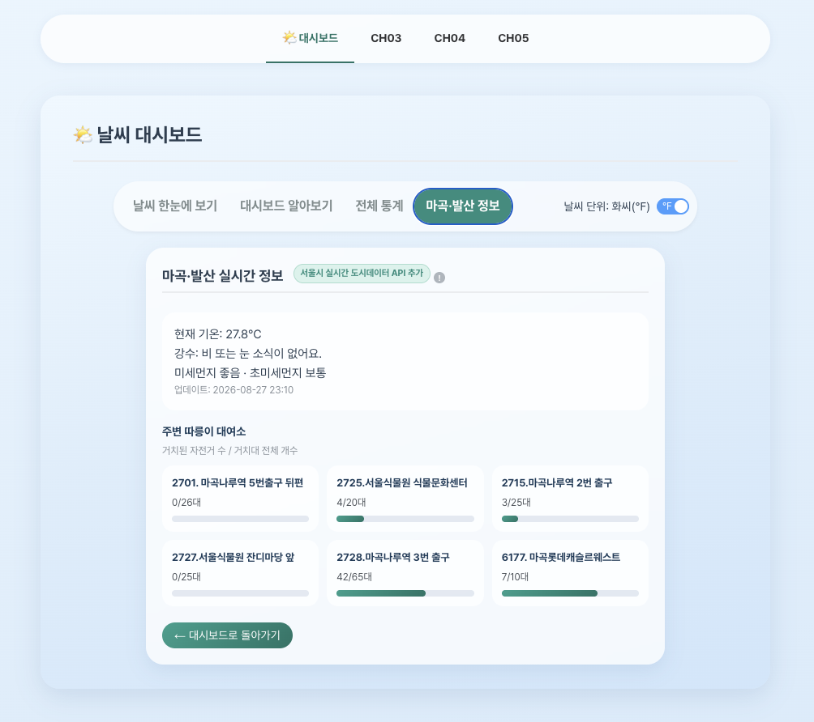
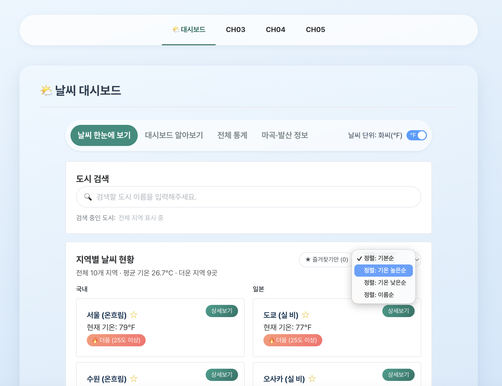
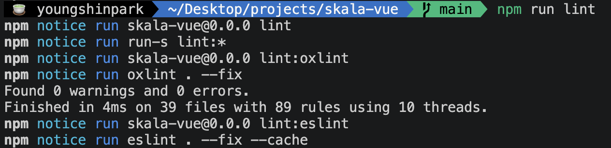
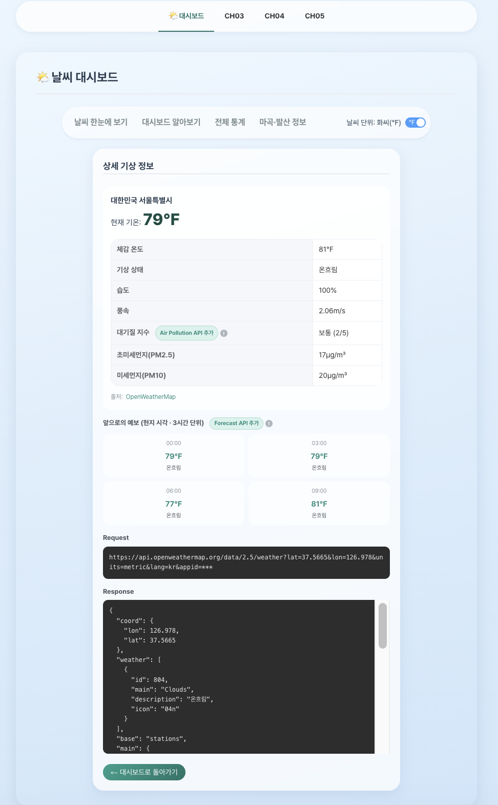

# Frontend-framework: Vue.js

- **과목명**: Frontend-framework: Vue.js
- **작성자**: 박영신
- **최종 제출일자**: 2026-08-27
- **소스 저장소**: https://github.com/dudtlstm/skala-vue (Public)
- **배포 URL**: https://skala-vue-dudtlstm.vercel.app/
- **제출 전 확인**: 시크릿 창에서 저장소·배포 URL 모두 로그인 없이 정상 접속 확인 (2026-08-27)

## 프로젝트 개요

CH02~CH10 실습을 하나의 앱으로 누적 구현한 **날씨 대시보드**입니다. 지역별 현재 날씨/대기질/예보를
카드로 보여주고, 상세·통계 페이지와 서울시 실시간 도시데이터 연동 화면을 제공합니다.

| 구분 | 사용 기술 |
| ---- | --------- |
| 프레임워크 | Vue 3.5 (`<script setup>` Composition API) |
| 빌드 도구 | Vite 8 |
| 라우팅 / 상태 | Vue Router 5, Pinia 3 |
| HTTP / UI | axios, Element Plus |
| 품질 관리 | ESLint(+oxlint), Prettier, 프로덕션 빌드 시 terser로 console 제거 |
| 외부 API | OpenWeatherMap(현재날씨·대기질·예보), 서울 열린데이터광장(실시간 도시데이터) |

### 로컬 실행 방법

```bash
npm install
cp .env.example .env.local   # 발급받은 실제 API 키 입력
npm run dev                  # http://localhost:5173
```

- API 키는 Git에 커밋하지 않습니다. 필요한 환경변수는 `.env.example` 참고
  (`VITE_OPENWEATHER_API_KEY`, `VITE_SEOUL_CITY_DATA_KEY`).
- 서울 열린데이터광장 API는 HTTP 전용이라, 개발 서버는 Vite proxy(`/seoul-api`),
  배포 환경은 `vercel.json` rewrites를 경유합니다. (CH08 참고)

## 변경 이력

| 버전 | 작성자 | 작성일자   | 변경 내용                                          |
| ---- | ------ | ---------- | ------------------------------------------------- |
| v0.1 | 박영신 | 2026-08-26 | README 틀 최초 작성 (CH02~CH10 챕터 구조 생성)     |
| v1.0 | 박영신 | 2026-08-27 | CH02~CH10 전체 코드 구현 완료                      |
| v1.1 | 박영신 | 2026-08-27 | Vercel 배포 완료                                  |
| v1.2 | 박영신 | 2026-08-27 | 배포 환경 서울시 API mixed content 오류 수정(프록시) |
| v1.3 | 박영신 | 2026-08-27 | README 보강 (저장소 URL·프로젝트 개요·실행 방법·`.env.example`) |

## 목차

- [프로젝트 개요](#프로젝트-개요)
- [변경 이력](#변경-이력)
- [CH02 Getting Started with Vue.js](#ch02-getting-started-with-vuejs)
- [CH03 Vue Syntax](#ch03-vue-syntax)
- [CH04 Composition API](#ch04-composition-api)
- [CH05 Vue Components](#ch05-vue-components)
- [CH06 Vue Router](#ch06-vue-router)
- [CH07 Pinia](#ch07-pinia)
- [CH08 Axios](#ch08-axios)
- [CH09 UI Libraries](#ch09-ui-libraries)
- [CH10 Vite Build & Deployment](#ch10-vite-build--deployment)
- [느낀점 / 생각한 점](#느낀점--생각한-점)

## CH02 Getting Started with Vue.js

**요구사항 이행**

- `create-vue`(create-vue@3.x)로 `skala-vue` 프로젝트 스캐폴딩 — Vue Router / Pinia / ESLint / Prettier 옵션 포함
- `npm install` → `npm run dev`로 로컬 개발 서버(`localhost:5173`) 구동 및 동작 확인
- HMR 확인: `src/views/AboutView.vue`의 템플릿을 수정해 새로고침 없이 즉시 반영되는 것 확인
- Vue Devtools(`vite-plugin-vue-devtools`) 오버레이로 Components / Pinia / Router / Timeline 탭 확인
- 생성된 프로젝트 구조(`src/main.js` → `App.vue`, `router/`, `stores/`, `views/`, `components/`) 파악

**요구사항과 다르게 한 점 / 이유**

- 없음

**추가로 구현한 것**

- ESLint(+oxlint)/Prettier가 기본 구성된 채로 시작해, 이후 챕터 내내 `npm run lint` / `npm run format`으로 코드 품질을 관리 (CH10에서 커스텀 규칙 추가)



> create-vue로 만든 프로젝트를 빌드해 Vercel에 올린 실제 배포 화면. 이후 CH03~CH10 실습이 모두 이 앱 하나에 누적됩니다.

## CH03 Vue Syntax

**요구사항 이행**

- `v-for` + `:key="city.id"`로 지역별 날씨 카드를 반복 출력 (`WeatherMockup.vue`)
- `v-if`/`v-else`로 25도 기준 "🔥 더움"/"❄️ 선선함" 배지 분기
- 도시 이름 한글 검색 input을 `:value` + `@input`으로 구현 (`v-model` 미사용)
- 카드 클릭 시 상태바에 "{도시}이 선택되었습니다" 표기, 카드 내부 [상세보기] 버튼은 `@click.stop`으로 버블링을 막고 `window.alert`로 날씨 내용을 띄움
- 본인 데이터 추가: 기본 3개 도시(서울/수원/부산) + 개인 추가 2개(의정부/포항)

**요구사항과 다르게 한 점 / 이유**

- 없음

**추가로 구현한 것**

- 검색어에 맞춰 조사(이/가)를 자동으로 붙여주는 유틸 작성 (`src/utils/koreanParticle.js`의 `subjectParticle`)
- 검색창에 돋보기 아이콘·지우기 버튼·현재 검색어 표시 UI 추가



> v-for로 반복 출력한 카드, 25도 기준으로 v-if 분기되는 🔥더움/❄️선선함 배지, v-model 없이 :value + @input으로 만든 한글 검색창.

## CH04 Composition API

**요구사항 이행**

- 반응형 상태: 검색어(`keyword`), 선택 도시 정보(`lastSelectedCity`), 지역별 날씨 배열(`cityWeathers`)
- `computed`로 검색어 필터링 배열(`visibleWeathers`) 구성
- `watch`로 상태바 문구(`noticeMessage`) 변경 시 콘솔 로그, `watchEffect`로 검색어(`keyword`) 타이핑 추적 로그
- 템플릿에서 검색어 없음/일치 데이터 있음/일치 데이터 없음 3가지 케이스 분기 표시

**요구사항과 다르게 한 점 / 이유**

- 없음.

**추가로 구현한 것**

- `watch`의 여러 활용 형태를 보여주기 위해 Multi-Source Watch(`[keyword, noticeMessage]` 동시 감시), 특정 속성만 추적하는 `watch(() => lastSelectedCity.temp, ...)`까지 추가로 작성
- 평균 기온·더운 지역 수를 보여주는 `summary-line` computed 추가



> computed로 검색어를 필터링하고 watch/watchEffect로 상태 변화를 추적하는 화면. 상단 요약줄(평균 기온·더운 지역 수)이 추가로 만든 computed입니다.

## CH05 Vue Components

**요구사항 이행**

기능 변경 없이 4개 컴포넌트로 분리했습니다.

- `WeatherParent.vue`: 모든 반응형 데이터 유지
- `BaseDashboardCard.vue`: 검색박스/리스트박스 디자인 공통화, `<slot>`으로 자식 주입
- `SearchBar.vue`: `currentQuery` prop으로 검색어 표시, `update-query` emit으로 부모에 검색어 전달
- `WeatherCard.vue`: `cityItem` prop으로 도시 객체 표시, `select-card`/`click-detail` emit으로 부모에 이벤트 전달
- 각 컴포넌트마다 `<style scoped>` 분리 적용

**요구사항과 다르게 한 점 / 이유**

- 없음. 이후 CH09에서 각 컴포넌트 안쪽의 화면 태그만 Element Plus 컴포넌트(`el-card`/`el-tag`/`el-button`)로 갈아끼웠지만(겉모습만 교체), 부모·자식이 props/emits로 주고받는 구조는 그대로 유지했습니다.

**추가로 구현한 것**

- `WeatherSummary.vue` 컴포넌트 추가 (전체 지역 수/평균 기온/더운 지역 수 표시)
- `favoriteStore`(CH07) 연동한 즐겨찾기(★) 버튼을 `WeatherCard.vue`에 추가



> 한 덩어리였던 화면을 WeatherParent / BaseDashboardCard / SearchBar / WeatherCard 4개로 분리한 결과. 카드의 ★ 즐겨찾기 버튼은 추가로 만든 컴포넌트입니다.

## CH06 Vue Router

**요구사항 이행**

- 라우터 지연 로딩(동적 `import()`) + Catch-all Route(`/:pathMatch(.*)*`) 적용
- Navigation Bar(`RouterLink`) + `RouterView` 배치
- `WeatherHomeView.vue`가 `WeatherParent`를 대체: 상세보기 클릭 시 `window.alert` 대신 `router.push('/weather/' + id)`로 Programmatic Navigation 처리
- `WeatherDetailView.vue`: 라우트 파라미터(`cityId`)로 대상 도시를 찾아 상세 정보 표시
- `WeatherAboutView.vue`: 서비스 소개 + 대시보드로 돌아가기
- `NotFoundView.vue`: Catch-all(`/:pathMatch(.*)*`) 경로 전용 404 페이지 (CH09에서 화면 부분만 `el-result`로 교체)
- 본인 추가 View 라우팅

**요구사항과 다르게 한 점 / 이유**

- Navigation Bar(`RouterLink`)가 원래는 `App.vue`에 있어야 하는데, 지금은 `DashboardLayoutView.vue`에 있습니다. CH09~10 작업 중 "CH03~05는 최상단 탭으로 분리하고 CH06 이후는 대시보드로 통합"하는 사이트 구조 개편을 진행하면서, `App.vue`는 사이트 전체 최상단 nav(`SiteNavBar.vue`)만 갖는 얇은 셸이 되고, 원래 CH06의 nav+RouterView 역할은 대시보드 전용 레이아웃 파일로 옮겨졌습니다. `RouterLink` 기반 내비게이션이라는 방식 자체는 동일하고 기능도 그대로지만, 파일 위치가 요구사항 문구와 달라졌습니다.

**추가로 구현한 것**

- 본인 추가 View 2개: `WeatherStatsView.vue`(전체 지역 통계), `WeatherSeoulView.vue`(마곡·발산 실시간 정보 — CH08 기타 외부 API 요구사항과 연결)
- 중첩 라우트 구조로 `/`, `/about`, `/stats`, `/seoul`, `/weather/:cityId`를 대시보드 레이아웃 하위로, `/ch03`~`/ch05`를 최상단 별도 탭으로 분리



> 주소창에 정의되지 않은 경로(/ch05d)를 직접 입력한 상태. Catch-all 라우트가 받아 NotFoundView를 띄우고, vercel.json 설정 덕분에 새로고침해도 Vercel 기본 404가 아니라 앱의 404가 나옵니다.

## CH07 Pinia

**요구사항 이행**

- `stores/configStore.js`: state `unit`(초기값 `celsius`) / getter `unitSymbol`(℃·℉) / action `toggleUnit`
- `UnitToggler.vue`를 Navigation Bar 옆에 배치
- 메인(`WeatherCard.vue`)과 상세(`WeatherDetailView.vue`) 양쪽에 단위 변환 적용
- 본인 추가 Store 작성

**요구사항과 다르게 한 점 / 이유**

- 없음. 요구사항이 참고로 제시한 대로, 메인/상세에 중복되던 단위 변환 로직은 `useDisplayTemp` 컴포저블로 분리해 재사용했습니다.

**추가로 구현한 것**

- `favoriteStore.js`: 즐겨찾기 도시를 전역 상태로 관리하는 독립 스토어
- `configStore`에 지역 카드 정렬 기준(`sortOrder`/`sortLabel`) 상태 추가



> 상단 스위치를 화씨(℉)로 바꾸면 Pinia 스토어(configStore)의 unit 값 하나가 바뀌고, 그 값을 쓰는 모든 카드 기온이 동시에 ℉로 전환됩니다.

## CH08 Axios

**요구사항 이행**

1. OpenWeatherMap API로 실제 날씨 데이터 연동 (`openWeatherClient.js`)
2. OpenWeatherMap 제공 API 추가: 대기질(Air Pollution) API, 5일치 예보(Forecast) API
3. 기타 외부 API 추가: 서울 열린데이터광장의 실시간 도시데이터(citydata) API로 마곡·발산 지역 정보 연동 (`seoulCityDataClient.js`)

**요구사항과 다르게 한 점 / 이유**

- 서울 열린데이터광장 API(`openapi.seoul.go.kr:8088`)는 **HTTP 전용**이라, 원래 코드처럼 `http://`로 직접 호출하면 `http://localhost` 개발 서버에서는 되지만 **HTTPS로 배포된 사이트에서는 브라우저가 차단**합니다. HTTPS 페이지에서 HTTP 주소로 보내는 요청을 브라우저가 막는 정책(mixed content) 때문이며, 실제 배포 후 "서울시 실시간 정보를 가져오지 못했습니다" 오류로 확인했습니다. HTTPS 엔드포인트도 지원하지 않아 브라우저에서 직접 호출하는 방법이 없어서, **서버가 대신 호출하는 프록시**로 우회했습니다.
  - `seoulCityDataClient.js`의 base URL을 상대경로 `/seoul-api`로 변경
  - 개발: `vite.config.js`에 `/seoul-api` → `http://openapi.seoul.go.kr:8088` dev proxy 추가
  - 배포: `vercel.json` rewrites로 `/seoul-api/*`를 서버사이드에서 프록시 (Vercel → upstream HTTP 통신은 mixed content 대상이 아님)

**추가로 구현한 것**

- API 키는 `.env.local`에만 저장하고 `.gitignore`의 `*.local` 패턴으로 Git에서 제외, 디버그용 요청 주소 표시 시에도 `appid=***`로 마스킹
- 기준 지역을 마곡·발산(서울식물원·마곡나루역)으로 잡은 이유는 바로 옆이 김포공항이기 때문이며, 김포공항의 국제선이 대부분 일본행 노선이라 해외 도시 목록도 유럽 등 대신 도쿄·오사카·나고야·후쿠오카·삿포로 등 일본 주요 도시로 구성
- 예보 데이터의 UTC 시각을 도시별 timezone 오프셋으로 변환해 현지 시각 기준으로 표시



> 서울 열린데이터광장 실시간 도시데이터(마곡·발산 기온, 주변 따릉이 대여 현황). HTTP 전용 API라 배포 환경에서 프록시를 거쳐 불러온 결과입니다.

## CH09 UI Libraries

**요구사항 이행**

- 외부 UI Library로 **Element Plus**를 선정해 CH03~08 전반에 자유롭게 적용
- 적용 컴포넌트: `el-menu`(사이트 nav), `el-card`, `el-tag`, `el-button`, `el-switch`, `el-skeleton`, `el-descriptions`, `el-result`

**요구사항과 다르게 한 점 / 이유**

- 처음엔 검색창(`el-input`)과 상세보기 알림(`ElMessage`)에도 Element Plus를 적용했지만, 이건 CH03이 명시한 `:value`/`@input`, `window.alert` 요구사항과 충돌했습니다. 게다가 `el-input`은 한글 IME 조합 중에는 내부적으로 갱신 이벤트 자체를 건너뛰는 구조라(`isComposing` 가드), 타이핑 중 마지막 글자가 한 박자 늦게 반영되는 문제가 있었습니다. 그래서 검색창은 el-input을 걷어내고 순수 `<input>` + `:value`/`@input`으로, 상세보기 알림은 다시 `window.alert`로 되돌려 CH03 요구사항을 그대로 지켰습니다. UI 라이브러리는 이 두 곳을 제외한 나머지 영역에 적용했습니다.

**추가로 구현한 것**

- 사이트 전체에 하늘색 그라데이션 테마 적용, Element Plus 전역 라운드 처리 토큰(`--el-border-radius-base` 등) 커스터마이징
- 더움/선선함 배지·버튼을 소프트 그라데이션 색상으로 커스텀 스타일링
- 반응형 레이아웃 재정비 (좁은 화면에서 카드 컬럼 1단으로 전환 등)



> 카드·배지·버튼·스위치·정렬 드롭다운이 모두 Element Plus 컴포넌트(el-card / el-tag / el-button / el-switch / el-select)로 교체된 상태. 정렬 드롭다운을 연 모습입니다.

## CH10 Vite Build & Deployment

**요구사항 이행**

- Source Code 품질관리: `npm run lint`(oxlint + eslint) 무결점 확인, API 키는 `.env.local`로 분리해 Git에 미노출
- Build & Deployment: `npm run build`로 프로젝트 빌드 → **Vercel**에 정적 파일 배포 후 확인



> `npm run lint`(oxlint + eslint) 실행 결과. 39개 파일에서 경고·오류 0건.

**요구사항과 다르게 한 점 / 이유**

- 없음.

**추가로 구현한 것**

- `eslint.config.js`에 커스텀 규칙 추가 (`no-unused-vars: warn`, `no-console: off`, `vue/multi-word-component-names: off`) — `no-console`은 CH04의 watch/watchEffect 요구사항이 실제로 `console.log`를 필요로 하기 때문에 lint 레벨에서는 계속 허용
- 대신 **프로덕션 빌드에서만** console/debugger를 제거하도록 `vite.config.js`에서 `build.minify: 'terser'` + `terserOptions.compress.drop_console/drop_debugger` 설정 (개발 서버는 영향 없음). 참고로 이 프로젝트의 Vite 버전은 기본 압축기가 esbuild에서 Oxc로 바뀌어 있어서, 흔히 쓰는 `esbuild.drop` 옵션은 실제로 적용되지 않아 terser로 별도 전환함
- GitHub 저장소를 Vercel에 연동해 `main` 브랜치에 push할 때마다 자동으로 재배포되는 CI/CD 구성 (별도 GitHub Actions 없이 Vercel 자체 Git 연동으로 처리)
- `vercel.json` 추가: ① `/seoul-api/*` → 서울 열린데이터광장(HTTP) 서버사이드 프록시(CH08 참고), ② 그 외 모든 경로 → `/index.html` SPA fallback(`createWebHistory` 새로고침 404 방지)



> 배포된 앱의 상세 페이지. OpenWeatherMap 현재날씨·대기질·예보 3개 API가 실시간으로 응답하며, 디버그용 요청 주소에서 API 키는 appid=***로 가려집니다.

## 느낀점 / 생각한 점

- CH05에서 컴포넌트를 4개로 나누는 이유를 CH09에서 화면을
  전부 Element Plus로 바꾸면서 이유를 알았다. 부모·자식이 props와 emit으로 주고받는 부분만 안 건드렸더니
  카드 안쪽을 통째로 갈아엎어도 부모 컴포넌트는 손댈 필요가 없기 때문이다. 나눠두면 나중이 편하다는 걸 직접 느꼈다.
- 제일 당황했던 건, 로컬에서 잘 되던 서울시 API가 배포한 뒤 배포된 url로 들어가보니 "가져오지 못했습니다" 에러를 뱉은
  것이었다. 찾아보니 서울시 API는 `http`만 지원하는데 배포된 사이트는 `https`라서, 브라우저가 요청을
  막고 있었다. 브라우저 쪽에서 우회할 방법은 없어서 개발할 때는 Vite proxy로, 배포에서는
  `vercel.json`으로 서버가 대신 요청을 보내게 만들어 해결했다. 프론트엔드가 서버 없이 외부 API를 직접
  부르는 게 늘 되는 건 아니라는 걸 알게 됐다.
- CH10에서 배포용 빌드 때 `console.log`를 지우려고 자료에 나온 `esbuild.drop`을 넣었는데 아무리 해도
  안 지워졌다. 알고 보니 이 프로젝트의 Vite 버전은 기본 압축기가 esbuild가 아니라 Oxc로 바뀌어 있어서
  그 옵션이 안 먹히는 거였다. terser로 바꿔서 겨우 해결했는데, 자료 그대로 따라 해도 버전이 다르면
  안 될 수 있다는 걸 배웠다.
